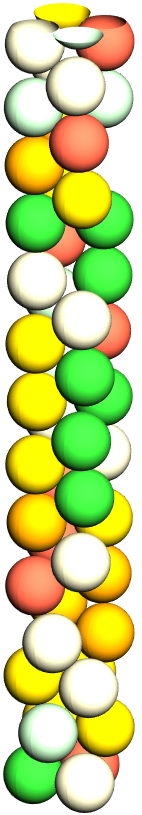

# Narrow Cylinder Packings

## Installing code
g++ -O3 -std=c++17 -o InitializeParticles.exe InitializeParticles.cpp

g++ -O3 -std=c++17 -o RCPGenerator_ForSam.exe RCPGenerator.cpp

## Creating initial configuration
./InitializeParticles.exe   --N 500   --Ndim 3   --phi 0.05   --dist mono   --d 1.0   --box 4,4,250   --walls -2,0,1   > Init.txt

## Quenching configuration via ADAM optimizer
time ./RCPGenerator_ForSam.exe --file Init.txt --output Final.txt --box 4,4,250 --walls -2,0,1 --verbose --NeighborMax 10000

### print out to terminal
Success: Packing achieved.

Step 296167: Phi = 0.504081, mu = 5e-06, max overlap = 4.73742e-06, |F|/<F> = 0.00914951, mu = 5e-06

Done! Took 296167 steps

Final Packing Fraction 0.395904

Max overlap: 4.73742e-06

|F|/<F>: 0.00914951
Output written to SamFinal.txt

real    6m41.211s
user    6m41.148s
sys     0m0.032s

## Visual of packing it produced

